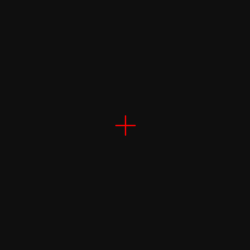
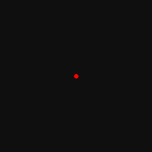
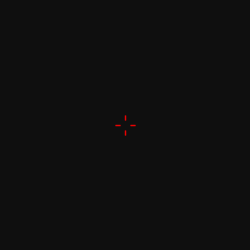
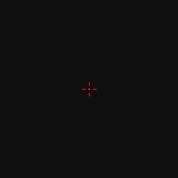
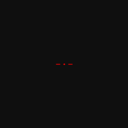
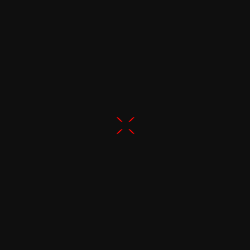
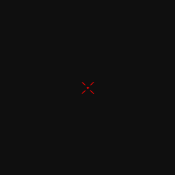
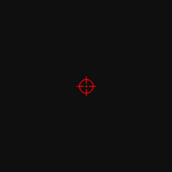
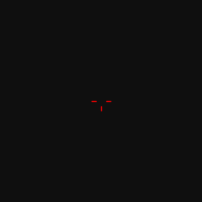

# OpenCV Crosshair Library
# OpenCV Crosshair Library

A lightweight and modular Python library providing multiple crosshair (reticle) styles implemented using OpenCV.

Designed for real-time overlays, FPS-style visualizations, drone interfaces, and computer vision projects such as YOLO-based detection systems.

---

## Overview

This collection features customizable reticles built with a clean, modular architecture. Each crosshair is designed to be easily integrated into any OpenCV pipeline, especially for tracking and targeting tasks.

This library was developed as part of a Teknofest-oriented computer vision project focusing on real-time targeting systems.

**Key Features:**
- **Standalone Modules:** Each style is a separate, reusable script.
- **Customizable:** Fully adjustable parameters (length, thickness, gap, color).
- **Anti-aliased Rendering:** Uses `cv2.LINE_AA` for smooth edges.

---

## Gallery

Below are the available crosshair styles.  
You can preview them here, then run `test.py` locally to experiment and integrate them into your own project.

| Style Name | Preview |
| :--------- | :-----: |
| **Classic** |  |
| **Center Dot** |  |
| **Gap Cross** |  |
| **Dot-Dash** |  |
| **Dotted** |  |
| **X Cross** |  |
| **Gap X Cross** |  |
| **Tactical X** |  |
| **Circle Cross** |  |
| **T-Shape** |  |
| **Chevron** |  |

---

## Installation

1. Clone the repository:

git clone https://github.com/yourusername/opencv-crosshair-library.git  
cd opencv-crosshair-library  

2. Install dependency:

pip install opencv-python  

---

## Usage

Run the interactive selector:

python test.py  

Steps:
1. A numbered list of available crosshairs will appear.
2. Enter the number of the desired style.
3. Selection confirmation is displayed.
4. The preview window opens.
5. Press **Q** to close.

You can then import any crosshair function directly into your own OpenCV project.

Example:

from crosshairs.classic_crosshair import draw_classic  

---

## Customization

Each crosshair function supports configurable parameters:

- `length` → Line size  
- `thickness` → Line thickness  
- `gap` → Space between center and lines  
- `color` → BGR color tuple (e.g., (0, 0, 255) for red)

The gap parameter prevents proportional distortion when scaling crosshair size.

---

## Integration

These crosshairs are suitable for:

- Real-time webcam overlays
- Drone HUD interfaces
- Object detection visualization (YOLO)
- FPS-style UI experiments
- Computer vision prototypes

Simply import the desired module and draw on your frame before display.

---

## License

This project is licensed under the [MIT License](LICENSE).